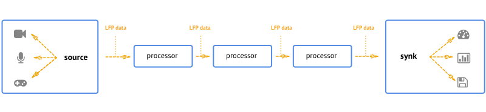

# LFO - Low Frequency Operators

LFO is an API that aims to formalise the processing and analysis of arbitrary data streams (audio, video, sensor data etc.). By normalising the stream format in it's input and output ends we will be able to manipulate and analyse the data through a processing chain and encapsulate common processing algorithms with a unified interface that can be shared and reused.

